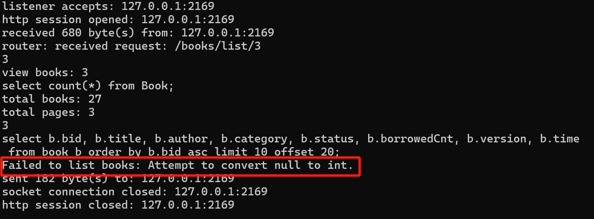

# 数据库

**注意你的数据库 `book` 中 `bid` 是 `std::string` 类型**

```c++
std::optional<boost::json::object> delete_books(
	std::shared_ptr<bserv::db_connection> conn,
	std::shared_ptr<bserv::session_type> session_ptr,
	const std::string& bookid) { //是string，因为数据库book中bid数据类型是string
	lgdebug << "view bid: " << bookid << std::endl;
	bserv::db_transaction tx{ conn };

	bserv::db_result r = tx.exec(
	"select * from book where bid = ?", bookid);
	lginfo << r.query(); // this is how you log info
	if (r.begin() != r.end()) {
		bserv::db_result afterdelete = tx.exec(
			"update book "
			"set is_active = 'false' "
			"where bid = ?;",
			bookid);
		tx.commit();
		return orm_book.convert_to_optional(afterdelete);
	}
}
```


## create数据库：

- 列定义列表的最后一个列定义后面不应该有逗号

- 注意不要用保留字命名

## 查询语句：

- 行尾留空格

  ```c++
  db_res = tx.exec(
  	"select b.bid, b.title, b.author, b.category, b.status, b.borrowedCnt, b.version, b.time "
  	"from book b "
  	"order by b.bid asc "
  	"limit 10 offset ?;",
  		(page_id - 1) * 10
  	);
  ```

## 分页功能

```c++
db_res = tx.exec(
	"select b.bid, b.title, b.author, b.category, b.status, b.borrowedCnt, b.version, b.time "
	"from book b "
	"order by b.bid asc "
	"limit 10 offset ?;",
	(page_id - 1) * 10 //参数用于指定 SQL 查询中的偏移量（offset），从而实现分页查询、返回
	);
```
分页查询的逻辑：**先排序后分页**

1. **排序** (`ORDER BY b.bid ASC`): 这确保了返回的记录是按照 `bid` 字段的升序排列的。这意味着无论你查询哪一页，结果都会是有序的。
2. **限制结果数量** (`LIMIT 10`): 这限制了查询结果最多只能返回 10 条记录。在分页查询中，这通常对应于每页显示的记录数。
3. **偏移量** (`OFFSET (page_id - 1) * 10`): 这**指定了从哪一条记录开始返回结果**。`OFFSET` 的值是基于当前页码 `page_id` 计算的。由于页码通常从 1 开始，所以 `page_id - 1` 实际上是计算了在当前页之前有多少个页面的记录需要被跳过。然后乘以每页的记录数（在这个例子中是 10）来得到实际的偏移量。如果最后一页的记录数不足 `LIMIT` 指定的数量（在这个例子中是 10条），查询将返回所有剩余的记录。

​		

# bserv

## 数据库操作

### SQL 查询字符串构造

SQL 查询是以字符串的形式发送给数据库服务器的。无论是直接通过管理界面，还是在程序中通过数据库驱动和API，最终的查询都是一个字符串。因此，当我们在程序中动态构造查询时，需要将所有的变量（包括整数、浮点数等）转换为字符串形式，以便它们可以被插入到这个查询字符串中。

因此对于处理数值（如整数）的情况，您可能需要类似 `db_value<int>` 这样的类。这类处理数值的类会接受整数或其他类型的数值，并在内部可能将其转换为字符串形式，以便用于 SQL 语句。

### 查询

```c++
exec("select * from ? where ? = ? and first_name = 'Name??'",
	db_name("auth_user"), db_name("is_active"), db_value<bool>(true));
-> SQL: select * from "auth_user" where "is_active" = true and first_name = 'Name?'
======================================================================================
exec("select * from ? where ? = ? and first_name = ?",
     db_name("auth_user"), db_name("is_active"), false, "Name??");
-> SQL: select * from "auth_user" where "is_active" = false and first_name = 'Name??'
======================================================================================
Note: "?" is the placeholder for parameters, and "??" will be converted to "?" in SQL.
      But, "??" in the parameters remains.
```

db_name("username")是数据库元素（列名）
username是对应的是值

大部分情况，db_name("username")可以直接写在sql里，不用 “?”

### 代码中注意事务提交

事务的提交通常用于确保修改数据库状态的操作（如 INSERT、UPDATE、DELETE）被永久保存。

## database.hpp

### db_name 类解析

在您提供的代码中，`db_name` 定义在 `database.hpp` 文件中，并且被用作 `db_parameter` 的一种实现。它主要用于确保在SQL查询中正确和安全地引用数据库表名或列名。

#### 构造函数和方法

```
class db_name : public db_parameter {
private:
    std::string value_;
public:
    db_name(const std::string& value)
        : value_{ value } {}
    std::string get_value(raw_db_transaction_type& tx) {
        return tx.quote_name(value_);
    }
};
```

- **构造函数**：接受一个字符串 `value`，这个值通常是一个数据库的表名或列名。
- **get_value**：使用 `tx.quote_name(value_)` 来获取经过处理的数据库名字，这通常意味着它会被正确地转义，以避免SQL注入问题，并确保名称可以被数据库接受。这是通过使用 `pqxx` 的 `quote_name` 方法完成的，它返回一个安全的、可用于SQL语句的引用。

### 在SQL语句中使用 db_name

在构建SQL语句时，`db_name` 类的实例用于确保表名和字段名被正确处理。例如，你可能会这样使用它：

```
db_transaction tx(conn);
std::string sql = "SELECT * FROM " + db_name("users").get_value(tx);
```

这个例子直接使用 `db_name` 来确保 `"users"` 被安全地用作SQL查询的一部分。这样做可以预防SQL注入攻击，特别是在动态构建查询字符串时。


## handlers.cpp

### ORM映射

这里定义了一个ORM（对象关系映射）对象`orm_user`，它将数据库查询结果映射到JSON对象。每个`bserv::make_db_field`调用都指定了数据库字段的类型和在JSON对象中的名称。

```cpp
bserv::db_relation_to_object orm_user{
    // 注册一个ORM映射（用于将数据库查询结果转换成JSON对象）。
    // 数据库查询结果包含多行，每行有若干字段。初始化列表中`make_db_field<Type[i]>(name[i])`的顺序
    // 对应于这些字段（`Type[0]`和`name[0]`对应第一个字段，`Type[1]`和`name[1]`对应第二个字段，依此类推）。
    // `Type[i]`是你希望转换该字段值的类型，`name[i]`是你希望在JSON对象中存储该字段的标识符，
    // 因此如果返回的JSON对象是`obj`，那么`obj[name[i]]`将会是`Type[i]`类型，并存储字段[i]的值。
};
```
### `get_user` 函数

这个函数接受一个数据库事务和一个用户名，执行查询，并将结果转换为JSON对象。如果用户存在，返回一个包含用户信息的`std::optional`，如果不存在，则返回空值。

```cpp
std::optional<boost::json::object> get_user(
    bserv::db_transaction& tx,
    const boost::json::string& username) {
    // ... 查询数据库并返回用户信息
	bserv::db_result r = tx.exec("select * from auth_user where username = ?", username);	//必须这么写 （如果有字段是日期，传字符串肯定不会出错）
	//通过事务对象 tx 执行一个SQL查询。查询语句使用了参数化的方式来避免SQL注入攻击，其中 ? 是一个占位符，
	// 后续由 username 填充。bserv::db_result r 是查询结果，它可能包含一个或多个行的数据。
	lginfo << r.query(); // 【日志记录】记录了执行的SQL查询，lginfo 是一个日志对象，用于输出信息级别的日志。这对于调试和监控数据库操作非常有用。
	return orm_user.convert_to_optional(r);		//简化写代码的方式
}
```
`boost::json` 库中确实包含用于处理JSON数据类型的类，例如 `boost::json::object`，`boost::json::array`，`boost::json::string`，等等，但它不定义基本数据类型如 `int`。

### `get_or_empty` 函数

此函数尝试从JSON对象中获取指定键对应的值，如果该键不存在，则返回空字符串。

```cpp
std::string get_or_empty(
//用来处理可能不存在的参数，如果不存在则返回空字符串，确保SQL执行不会因为缺少参数而失败。
	boost::json::object& obj,
	const std::string& key) {
	return obj.count(key) ? obj[key].as_string().c_str() : "";
}
```
### `hello` 函数

这个函数处理一个简单的"hello"请求。如果用户已登录，它会增加会话中的计数器并返回一个欢迎消息和计数。如果用户未登录，它只返回一个简单的"hello, world!"消息。

 **`response` 好像是用来：**如果函数是作为一个处理程序或回调函数，用于处理 HTTP 请求和响应，那么你可能需要一个 `response` 参数，该参数通常是一个指向响应对象的引用或指针。在这种情况下，函数不仅执行某些逻辑操作，还负责填充响应对象，然后将其发送回客户端。

```cpp
// 如果你需要手动修改响应（response）对象，函数的返回
// 类型应该是 std::nullopt_t，而返回值应该是 std::nullopt。
// std::nullopt_t 是一个特殊的类型，用于指示 
// std::optional 类型的变量不持有任何值，这在 bserv 框架中
// 用于表明函数没有返回具体的值，而是可能对 response 进行了
// 修改。std::nullopt 是一个对象，用于构造不包含值的
// std::optional 实例，通常用在不返回任何内容的场景。
std::nullopt_t hello(
	bserv::response_type& response,
	std::shared_ptr<bserv::session_type> session_ptr) {
	bserv::session_type& session = *session_ptr;
	boost::json::object obj;
	if (session.count("user")) {
		// 对会话（session）的修改必须在引用会话中的对象之前完成。
		// 这是因为修改可能会使得已引用的对象无效。例如，如果你计
		// 划在会话中添加一个新的条目（如 count），你应该首先执行
		// 这个添加操作。这样做可以防止在引用（如 user）时由于会
		// 话状态改变导致的潜在错误。
		if (!session.count("count")) {
			session["count"] = 0;
		}
		auto& user = session["user"].as_object();
		session["count"] = session["count"].as_int64() + 1;
		obj = {
			{"welcome", user["username"]},
			{"count", session["count"]}
		};
	}
	else {
		obj = { {"msg", "hello, world!"} };
	}
	// the response body is a string,
	// so the `obj` should be serialized
	response.body() = boost::json::serialize(obj);
	response.prepare_payload(); // this line is important!
	return std::nullopt;
}
```
### 用户注册
```cpp
//用户注册
boost::json::object user_register(
	bserv::request_type& request,
	// the json object is obtained from the request body,
	// as well as the url parameters
	boost::json::object&& params, //一个JSON对象，包含请求的所有参数
	std::shared_ptr<bserv::db_connection> conn) {
	if (request.method() != boost::beast::http::verb::post) {
		throw bserv::url_not_found_exception{};
	}
	//参数验证
	if (params.count("username") == 0) {
		return { //键值对
			{"success", false}, //表明请求处理失败。
			{"message", "`username` is required"} //提供一个明确的错误消息，告诉调用者 "username" 参数是必须的。
		};
	}
	if (params.count("password") == 0) {
		return {
			{"success", false},
			{"message", "`password` is required"}
		};
	}

    //用户注册逻辑
	auto username = params["username"].as_string(); //提取username键对应的值，并确保它是一个字符串
	bserv::db_transaction tx{ conn }; //创建了一个数据库事务对象 tx，使用从函数外部传递来的数据库连接 conn
	//检查用户名是否已存在
	auto opt_user = get_user(tx, username); //查询数据库。
    //（get_user 函数返回一个std::optional<boost::json::object>，如果找到用户，则包含用户数据。）
	if (opt_user.has_value()) { //检查返回的 std::optional 对象是否有值，即用户名是否存在
		return {
			{"success", false},
			{"message", "`username` existed"}
		};
	}
	auto password = params["password"].as_string();
	bserv::db_result r = tx.exec(
		"insert into ? "
		"(?, password, is_superuser, "
		"first_name, last_name, email, is_active) values "
		"(?, ?, ?, ?, ?, ?, ?)", 
		bserv::db_name("auth_user"), //插入新用户数据到 auth_user 表。
		bserv::db_name("username"),
        	//db_name("auth_user") 和 db_name("username") 是为了确保在构建 SQL 语句时，表名 "auth_user" 和
        	//列名 "username" 被正确引用。db_name类的get_value()方法会被调用来返回一个安全的、适合直接插入SQL语
        	//句的字符串。
		username,
		bserv::utils::security::encode_password(password.c_str()), //加密存储密码
        false, 
		get_or_empty(params, "first_name"),
		get_or_empty(params, "last_name"),
		get_or_empty(params, "email"), 
        true);

    //日志记录和提交事务
	lginfo << r.query(); //记录执行的SQL查询，有助于调试和日志分析
	tx.commit(); //显式提交事务，确保所有数据库操作被保存
	return {
		{"success", true},
		{"message", "user registered"}
	};
}
```
这两个函数处理用户注册和登录请求。它们检查请求方法是否为`POST`，验证必要的参数（如用户名和密码），执行数据库操作，并返回相应的JSON对象，表明操作成功或失败。

### session-会话管理

当用户登录后获取用户ID通常依赖于会话管理。用户ID应该在用户登录成功后被保存到会话中，这样在用户进行后续请求时，你可以从会话中轻松地检索出用户ID。这是一种常见的做法，用于维持用户状态和访问控制。

#### 用户登录后设置会话

```c++
boost::json::object user_login(
	bserv::request_type& request,
	boost::json::object&& params,
	std::shared_ptr<bserv::db_connection> conn,
	std::shared_ptr<bserv::session_type> session_ptr) {
	if (request.method() != boost::beast::http::verb::post) {
		throw bserv::url_not_found_exception{};
	}
	if (params.count("studentno") == 0) {
		return {
			{"success", false},
			{"message", "`student id` is required"}
		};
	}
	if (params.count("password") == 0) {
		return {
			{"success", false},
			{"message", "`password` is required"}
		};
	}
	auto studentno = params["studentno"].as_string();
	lginfo << studentno;
	bserv::db_transaction tx{ conn };
	auto opt_user = get_user(tx, studentno);
	if (!opt_user.has_value()) {
		return {
			{"success", false},
			{"message", "invalid student id/password 1"}
		};
	}
	auto& user = opt_user.value();
	if (!user["is_active"].as_bool()) {
		return {
			{"success", false},
			{"message", "invalid student id/password 2"}
		};
	}
	auto password = params["password"].as_string();
	auto encoded_password = user["password"].as_string();
	if (!bserv::utils::security::check_password(
		password.c_str(), encoded_password.c_str())) {
		return {
			{"success", false},
			{"message", "invalid student id/password 3"}
		};
	}
	bserv::session_type& session = *session_ptr;
	session["user"] = user;
	return {
		{"success", true},
		{"message", "login successfully"}
	};
}
```

#### 从会话中获取用户ID

在用户的后续请求中，如果你需要识别当前登录的用户，你可以从会话中获取用户ID。例如：

```c++
void some_function(std::shared_ptr<bserv::session_type> session_ptr) {
    if (session_ptr->exists("user_id")) {
        int user_id = (*session_ptr)["user_id"].as<int>();
        // 使用 user_id 进行其他操作，比如获取用户信息等
    }
}
```

这种方式确保了只要用户会话有效，你就可以随时访问到用户的ID，而不需要每次都要求用户发送它。确保在用户登出时清除会话，以保证安全性。


### 用户查找、登出和请求发送

```cpp
boost::json::object find_user(
    // ... 查找用户信息
);

boost::json::object user_logout(
    // ... 处理用户登出
);

boost::json::object send_request(
    // ... 发送HTTP请求并返回结果
);
```
`find_user` 根据用户名查找用户信息，但不返回用户ID和密码。`user_logout` 从会话中移除用户信息。`send_request` 发送一个HTTP请求到指定的URL，并返回响应。

### WebSocket 函数
```cpp
std::nullopt_t ws_echo(
    std::shared_ptr<bserv::session_type> session,
    std::shared_ptr<bserv::websocket_server> ws_server) {
    // ... 处理WebSocket echo请求
}
```
这个函数处理WebSocket连接，并在接收到消息时回显相同的消息。

### 静态文件服务和主页路由
```cpp
std::nullopt_t serve_static_files(
    bserv::response_type& response,
    const std::string& path) {
    // ... 服务静态文件
}

std::nullopt_t index_page(
    std::shared_ptr<bserv::session_type> session_ptr,
    bserv::response_type& response) {
    // ... 渲染主页
}
```
`serve_static_files` 函数用于提供静态文件服务，而`index_page` 函数渲染并返回主页。

### `redirect_to_users` 和 `view_users`函数

- 如果您正在构建一个需要服务器端页面渲染的传统 Web 应用，可能会倾向于使用 `view_users` 和 `redirect_to_users` 的结合。

```c++
std::nullopt_t view_users(
    //是一个接口函数，作为处理HTTP请求的入口点
    //逻辑:
	//1. 将页码从字符串转换为整数。
	//2. 创建一个空的 boost::json::object 对象，用于向下一个函数传递上下文信息。
	//3. 调用 redirect_to_users 函数，并将转换后的页码和其他参数传递过去。
	std::shared_ptr<bserv::db_connection> conn, //数据库连接的智能指针，用于执行数据库操作
	std::shared_ptr<bserv::session_type> session_ptr, //代表当前会话的智能指针，可能用于存储会话相关数据
	bserv::response_type& response,
	const std::string& page_num) {
	int page_id = std::stoi(page_num);
	boost::json::object context;
	return redirect_to_users(conn, session_ptr, response, page_id, std::move(context));
}
```

```c++
std::nullopt_t redirect_to_users(
    //负责实际的数据查询和响应处理
	std::shared_ptr<bserv::db_connection> conn,
	std::shared_ptr<bserv::session_type> session_ptr,
	bserv::response_type& response,
	int page_id,
	boost::json::object&& context //一个 JSON 对象，用于传递上下文信息
) {
    //使用日志记录当前正在查看的用户页码
	lgdebug << "view users: " << page_id << std::endl;
	//开始一个数据库事务
    bserv::db_transaction tx{ conn };
	bserv::db_result db_res = tx.exec("select count(*) from auth_user;");
	lginfo << db_res.query();
	std::size_t total_users = (*db_res.begin())[0].as<std::size_t>();
	lgdebug << "total users: " << total_users << std::endl;
	int total_pages = (int)total_users / 10;
	if (total_users % 10 != 0) ++total_pages;
	lgdebug << "total pages: " << total_pages << std::endl;
	db_res = tx.exec("select * from auth_user limit 10 offset ?;", (page_id - 1) * 10);
	lginfo << db_res.query();
    //将查询结果转换为 JSON 数组格式
	auto users = orm_user.convert_to_vector(db_res);
	boost::json::array json_users;
	for (auto& user : users) {
		json_users.push_back(user);
	}
    //构建分页信息，包括总页数、当前页、前一页、后一页以及是否显示省略号等
	boost::json::object pagination;
	if (total_pages != 0) {
		pagination["total"] = total_pages;
		if (page_id > 1) {
			pagination["previous"] = page_id - 1;
		}
		if (page_id < total_pages) {
			pagination["next"] = page_id + 1;
		}
		int lower = page_id - 3;
		int upper = page_id + 3;
		if (page_id - 3 > 2) {
			pagination["left_ellipsis"] = true;
		}
		else {
			lower = 1;
		}
		if (page_id + 3 < total_pages - 1) {
			pagination["right_ellipsis"] = true;
		}
		else {
			upper = total_pages;
		}
		pagination["current"] = page_id;
		boost::json::array pages_left;
		for (int i = lower; i < page_id; ++i) {
			pages_left.push_back(i);
		}
		pagination["pages_left"] = pages_left;
		boost::json::array pages_right;
		for (int i = page_id + 1; i <= upper; ++i) {
			pages_right.push_back(i);
		}
		pagination["pages_right"] = pages_right;
		context["pagination"] = pagination;
	}
	context["users"] = json_users;
	return index("users.html", session_ptr, response, context); //传递模板名和上下文，生成HTML页面返回给客户端
}
```

### `list_users`函数

- 如果您的应用遵循前后端分离的架构，或者您需要为移动应用或其他服务提供 API，`list_users` 提供了一个更直接和高效的方式来返回数据。
- 理解 **事务** ：主要是为了保证一组原子操作要么都完成，要么都不完成。主要应用：转账

```c++
//list_users 函数实际上是一个独立实现，它本质上与之前描述的 view_users 和 redirect_to_users 函数执行了相似的功能，但是以一个更简化和直接返回 JSON 对象的形式。这个函数旨在获取并返回活跃用户的分页列表，同样采用了分页逻辑来限制返回的用户数量，并通过 JSON 格式直接返回数据，适合在 API 调用中使用。
boost::json::object list_users(
	std::shared_ptr<bserv::db_connection> conn,
	std::shared_ptr<bserv::session_type> session_ptr,
	const std::string& s_page_id) 
{
	int page_id = std::stoi(s_page_id);
	lgdebug << "view users: " << page_id << std::endl;
	bserv::db_transaction tx{ conn };
	bserv::db_result db_res = tx.exec("select count(*) from auth_user where is_active;");
	lginfo << db_res.query();
	std::size_t total_users = (*db_res.begin())[0].as<std::size_t>();
	lgdebug << "total users: " << total_users << std::endl;
	int total_pages = (int)total_users / 10;
	if (total_users % 10 != 0) ++total_pages;
	lgdebug << "total pages: " << total_pages << std::endl;
	db_res = tx.exec(
		"select u.id, u.username, u.password, u.is_superuser, u.first_name, u.last_name, u.email, u.is_active "
		"from auth_user u "
		"where u.is_active "
		"group by u.id, u.username, u.password, u.is_superuser, u.first_name, u.last_name, u.email, u.is_active "
		"limit 10 offset ?;",
		(page_id - 1) * 10);
	lginfo << db_res.query();
	auto users = orm_user.convert_to_vector(db_res);
	boost::json::array json_users;
	for (auto& user : users) {
		user.erase("id");
		user.erase("password");
		json_users.push_back(user);
	}
	return { {"users", json_users}, {"total_users", total_users}, {"total_pages", total_pages} };
}
```


### 模板渲染
```cpp
std::nullopt_t index(
    const std::string& template_path,
    std::shared_ptr<bserv::session_type> session_ptr,
    bserv::response_type& response,
    boost::json::object& context) {
    // ... 使用模板渲染页面
}
```
`index` 函数使用提供的模板路径和上下文渲染页面。

这段代码展示了如何使用`bserv`框架来处理HTTP请求、与数据库交互、管理用户会话以及使用模板渲染网页。它使用了现代C++特性，如`std::optional`、`std::nullopt`和基于概念的模板编程。如果你是初学者，理解这些概念可能需要一些时间，但它们提供了强大的工具来构建高性能和类型安全的应用程序。


### params

- std::shared_ptr<bserv::db_connection> conn ：数据库连接的共享指针，用于数据库操作

- std::shared_ptr<bserv::session_type> session_ptr ：会话的共享指针，可能用于处理用户会话

  - 使用：`session_type = std::map<std::string, boost::json::value>;`

  - ```
    bserv::session_type& session = *session_ptr;
    session["user"] = user;
    return {
    	{"success", true},
    	{"message", "login successfully"}
    };
    ```

  `session` 被用于存储登录用户的信息。这是通过将一个 `user` 对象赋值给 `session` 的 `"user"` 键完成的。这使得任何后续请求都可以通过检查 `session["user"]` 来确认用户的登录状态和访问相应的用户信息。


- bserv::response_type& response ：响应对象，用于向客户端发送响应
- bserv::request_type& request ：请求对象，包含客户端发送的数据
- boost::json::object&& params ：从客户端接收的JSON对象参数，用于新用户的注册信息
- std::shared_ptr<bserv::db_connection> conn ：数据库连接的共享指针
- std::shared_ptr<bserv::session_type> session_ptr ：会话的共享指针


## rendering.cpp

用于处理web内容的渲染和静态文件服务。它使用Boost库中的Beast模块（主要用于网络编程）和Inja模板引擎（用于HTML模板渲染）。

### 1. 初始化渲染模板路径 (`init_rendering`)

这个函数接收一个表示模板文件根目录的字符串，并将其存储在全局变量`template_root_`中。如果传入的路径字符串不以斜杠(`/`)结尾，则会添加一个斜杠，确保路径的格式正确。这样做是为了方便后续的文件路径拼接操作。

### 2. 初始化静态文件路径 (`init_static_root`)

与`init_rendering`类似，这个函数用于设置静态文件的根目录，存储在全局变量`static_root_`中，并确保路径字符串以斜杠结尾。这对于后续提供静态文件服务是必要的。

### 3. 渲染模板 (`render`)

这个函数负责渲染HTML模板，并生成响应。具体步骤如下：

- 设置响应的HTTP头部`Content-Type`为`text/html`，表示响应的内容类型是HTML。
- 使用Boost JSON库将上下文对象（`context`）序列化成字符串，然后解析成Inja库使用的JSON格式。
- 使用Inja库渲染模板文件。模板文件路径是模板根目录`template_root_`和指定的模板文件名`template_file`的组合。渲染过程中，Inja库将模板中的变量替换为上下文数据中相应的值。
- 渲染完成后的HTML内容被存放在响应体中。
- 调用`prepare_payload`函数准备发送数据。

### 4. 服务静态文件 (`serve`)

这个函数用于响应静态文件的请求。它调用了`bserv::utils::file::serve`函数，该函数实现了从服务器的文件系统中查找并返回指定文件的功能。文件路径是静态文件根目录`static_root_`和请求的文件名`file`的组合。


## WebApp.cpp

是一个基于 C++ 的 HTTP 服务器的主函数实现，它用于配置和启动服务器。这段代码使用了Boost库和自定义的`bserv`命名空间中的组件，负责从配置文件读取设置、初始化服务，并定义了多个HTTP路由和处理函数。

### 函数及其功能

1. **show_usage()**
   - 显示服务器使用方法。当命令行参数不正确时，该函数被调用，向用户展示如何正确启动服务器。
2. **show_config()**
   - 显示服务器配置的详细信息。配置信息包括端口、线程数、日志旋转大小、日志路径、数据库连接数和数据库连接字符串。
3. **main()**
   - 程序入口点。处理命令行参数，读取配置文件，并初始化服务器。

### 配置文件处理

- 如果命令行参数数量不为2，即没有提供配置文件路径，程序将显示用法并退出。
- 如果提供了配置文件，程序尝试读取和解析JSON格式的配置文件。配置文件中可能包含服务器的端口、线程数、数据库连接数、日志目录等信息。
- 程序检查配置文件中是否包含必要的`template_root`和`static_root`路径。如果没有，程序将显示错误信息并退出。

### 服务器初始化与路由定义

- 使用`bserv::server_config`对象加载配置。

- 创建

  ```
  bserv::server
  ```

  实例，配置HTTP路由和WebSocket路由。

  - HTTP路由包括常见的用户操作（如注册、登录、登出）和静态文件服务。
  - WebSocket路由定义了一个`echo`功能，可能用于测试或实时通信。

- 使用`bserv::make_path`函数定义路由和关联的处理函数。这些处理函数位于其他文件中，例如`handlers.h`。

### 关键处理函数

- **serve_static_files()** 处理静态文件请求。
- **index_page()** 提供首页的HTML模板。
- **form_login() 和 form_logout()** 分别处理登录和登出的表单提交。

### 服务器的启动和运行

- 使用配置好的路由和WebSocket路由，启动服务器监听HTTP请求。
- 主函数最终返回`EXIT_SUCCESS`，表示程序正常运行。


## 其他

### 关于 `bserv::db_connection`

1. **作用**：`db_connection` 类型通常用于处理数据库连接的细节，如打开和关闭连接、执行SQL语句、管理事务等。
2. **方法**：这个类可能提供了方法来执行查询、插入、更新和删除操作，同时也可能处理错误和数据库连接的回收。

### config是什么

1. **存储配置信息**：
   - **端口号** (`port`)：服务器监听的网络端口。
   - **线程数** (`threads`)：用于处理请求的线程池大小。
   - **日志文件路径** (`log path`)：服务器日志存放的位置。
   - **数据库连接数** (`db-conn`)：可用于数据库操作的连接池大小。
   - **数据库连接字符串** (`conn-str`)：用于连接数据库的详细字符串，包括数据库类型、位置、用户名、密码等。
2. **方法和设置**：
   - 使用各种`set_`方法来设定上述参数，例如`set_port`、`set_num_threads`等。
   - 配置信息通常在程序启动时从一个外部的JSON文件中读取，如您的主函数中的逻辑所示。
3. **配置文件解析**：
   - 程序通过命令行参数接收配置文件的位置。
   - 使用Boost JSON库解析文件，将配置数据反序列化成`boost::json::object`对象。
   - 根据解析出的数据设置`config`对象的属性。
4. **程序中的使用**：
   - `config`对象在服务器初始化时被传递到`bserv::server`的构造函数中，这个服务器对象使用配置信息来设定网络监听的端口、处理请求的线程数等。
   - `config`的设置影响服务器的性能表现和功能行为，例如更多的数据库连接可以提高处理并发数据库请求的能力。

### GET 和 POST

**GET 方法：**

- **目的**：主要用于请求数据。GET请求应该是幂等的，这意味着无论执行多少次，结果都应该相同，并且不会对服务器上的数据产生改变。
- **数据传输**：参数通常附加在URL中（即查询字符串中），因此对于发送大量数据或敏感数据（如密码）来说，GET不是一个好选择。
- **缓存**：GET请求结果通常被浏览器缓存。
- **示例用途**：请求一个网页、图像或视频，查询数据库中的记录等。

**POST 方法：**

- **目的**：用于向服务器发送数据以创建或更新资源。POST请求不是幂等的，意味着每次请求都可能改变服务器上的状态或产生不同的结果。
- **数据传输**：数据通常在请求体中发送，这意味着可以发送更大量的数据，并且数据不会显示在URL中。
- **缓存**：POST请求不被缓存。
- **示例用途**：提交表单数据、上传文件、在数据库中创建或更新记录。


# 具体操作

## 定义数据模型

这个模型映射到数据库中的表。使用ORM（对象关系映射）工具。


要定义一个接收JSON并处理用户数据的API端点

## **定义处理函数**:

 创建一个函数，它将接收必要的参数，比如请求对象和数据库连接，从请求中提取JSON数据，执行逻辑（如添加用户到数据库），然后构建并返回一个JSON响应。

```c++
std::nullopt_t add_user_api(
    bserv::request_type& request,
    bserv::response_type& response,
    bserv::db_connection_ptr conn) {
    try {
        auto params = boost::json::parse(request.body()); // 解析JSON请求体
        // 假设params是一个包含用户数据的JSON对象
        // 进行数据库操作，例如插入新用户
        // 返回成功的JSON响应
        response.set_body(boost::json::serialize({{"status", "success"}}));
    } catch (const std::exception& e) {
        // 错误处理
        response.set_body(boost::json::serialize({{"status", "error"}, {"message", e.what()}}));
    }
    return std::nullopt;
}
```

### 注意

**会话修改顺序**：在对会话进行修改时，总是首先执行所有修改操作，然后再进行任何引用或查看操作。这样可以避免由于会话状态变更而导致的引用错误，保证会话的数据一致性和稳定性。

### 函数返回值

**`std::nullopt_t`**

- **用途**：`std::nullopt_t` 是 `std::optional` 类型的一个特殊标记，表示没有返回值。在这里，它用于表明函数不返回具体的值，而是可能会修改 `response` 对象或者抛出异常。
- **为什么使用**：在异步或事件驱动的环境中，如处理 HTTP 请求，通常不需要从函数返回值来获得结果。相反，函数通过修改引用或对象（如 HTTP 响应）来传达其结果，或者通过抛出异常来表示错误。这样的设计更符合非阻塞 I/O 操作的需求。

**`std::nullopt_t` 和 `std::nullopt`**：在设计 API 或处理 HTTP 请求时，如果你的函数主要通过修改引用或全局对象（如 `response`）来影响输出，而不是通过返回值，那么使用 `std::nullopt_t` 和 `std::nullopt` 作为返回类型和返回值是合适的。这样的设计模式在事件驱动或异步编程中很常见。


**`std::optional<boost::json::object>`** 

- `std::optional` 是一个模板，它封装了一个可选的值；如果值存在，则 `std::optional` 包含该值；如果不存在，则不包含值。这在数据库查询中很有用，因为有时候查询可能没有结果。


**`return orm_user.convert_to_optional(r);`**	

（一个ORM映射工具）将 `bserv::db_result` 转换为 `std::optional<boost::json::object>`，将数据库的行数据映射到JSON对象中，这样数据就可以以JSON格式在应用程序中使用或返回给客户端。**注意只能转换单个元素。**


## **路由绑定**: 

使用`bserv::make_path()`绑定上述处理函数到一个具体的URL。

```c++
bserv::make_path("/api/add_user", &add_user_api,
    bserv::placeholders::request,
    bserv::placeholders::response,
    bserv::placeholders::db_connection_ptr),
```

这样，当前端发起到`/api/add_user`的POST请求时，`add_user_api`函数将被调用，处理传入的JSON数据，并返回相应的结果。这种方式使得前后端通过JSON进行通信，前端负责显示和状态管理，后端负责数据处理和业务逻辑。


### 定义一个web应用中的路由

（即URL路径与处理函数之间的映射）。这一段代码的核心目的是将特定的HTTP请求路径与一个处理函数关联起来，并定义了处理该请求所需的上下文参数。

```c++
bserv::make_path("/form_add_user", &form_add_user,
	bserv::placeholders::request,
	bserv::placeholders::response,
	bserv::placeholders::json_params,
	bserv::placeholders::db_connection_ptr,
	bserv::placeholders::session),
```

- **路径与处理函数**

  - `"/form_add_user"`: 这是请求的路径，客户端向这个路径发送请求时，指定的处理函数将被调用。

  - `&form_add_user`: 这是处理函数的指针，指向一个具体的函数，该函数用于响应发送到上述路径的请求。

- **参数列表**

  - `bserv::placeholders::request`: 这个占位符可能代表正在处理的HTTP请求对象，允许访问请求的详细信息，如HTTP头部、请求体等。

  - `bserv::placeholders::response`: 这个占位符代表HTTP响应对象，用于构建并返回响应给客户端的数据。

  - `bserv::placeholders::json_params`: 这可能指的是解析请求体中的JSON数据后得到的参数对象，使得处理函数可以直接操作这些参数。

  - `bserv::placeholders::db_connection_ptr`: 这表示一个数据库连接的指针，提供数据库操作能力，使得函数可以执行如查询、更新等数据库操作。

  - `bserv::placeholders::session`: 这个占位符表示会话对象，常用于跟踪用户的状态和其他持续性信息。


## params

**`session_ptr`** 

（`std::shared_ptr<bserv::session_type> session_ptr`）

- **用途**：`session_ptr` 是一个**指向会话对象的智能指针**（通常是 `std::shared_ptr`），用于管理用户会话的生命周期。会话通常存储用户的登录状态、角色、偏好设置等跨请求的数据。
- **作用**：在HTTP应用中，会话用于跟踪用户的状态，因为HTTP协议本身是无状态的。通过会话，服务器能够识别出是哪个用户发出的请求，并据此提供个性化的响应。例如，在您的 `user_dashboard` 函数中，会话用来检查用户是否登录以及用户的角色。

**`response`**

(`bserv::response_type& response`)

- **用途**：`response` 是一个**引用传递的响应对象**，它提供了设置HTTP响应状态、头部和体（body）的方法。
- **作用**：这个对象用来构建最终发送给客户端的HTTP响应。例如，可以通过设置响应体来返回HTML页面、JSON数据或其他内容，也可以设置响应状态码和头部信息来告知客户端请求的处理结果。

**`context`**

(`boost::json::object contex`t)

- **定义**：在Web开发中，`context` 通常指的是在处理请求时持有的一组数据，这些数据将用于渲染响应，特别是在生成动态内容的HTML页面时。
- **用途**：`context` 作为一个字典（或对象），**存储了生成响应所需的所有变量和数据**。例如，在渲染一个HTML模板时，你可能需要向模板传递用户名称、权限列表或其他动态内容。

**`transaction` 事务**

(`bserv::db_transaction& tx`)

- 代表一个数据库事务。事务用于确保数据库操作的原子性，即要么所有操作成功完成，要么在出现错误时回滚到操作前的状态。


## 根据status设置图书”在库“还是”出借“

```c++
interface Book {
  bid: number
  title: string
  author: string
  category: string
  status: "在库" | "出借"; // 字符串是字面量类型，不能是number
  borrowedCnt: number
}

onBeforeMount(async () => {
  let res = await GetBookInfoByPageNum({
    pageNumber: 1
})
  res.books.forEach(item => {
    if (!item.id) {
        console.error("Item in 'books' array is missing 'bid' field", item);
        return;
      }
    // 根据 status 的值设置一个描述性的文本
    const bookStatusText = (item.status == 0 ? '在库' : '出借');    
    tableData.value.push({
      bid: item.id,
      title: item.title,
      author: item.author,
      category: item.category,
      status: bookStatusText, // 使用描述性的文本而不是原始的 status 值
      borrowedCnt: item.borrowedCnt
    });
  });
  total.value = res.total_books
  console.log('total_pages.value:',total.value)
})
    
//fetch DATa()也要改
    const fetchData = async () => {
  let res = await GetBookInfoByPageNum({
    pageNumber: currentPage.value
  })
  tableData.value=[]

  res.books.forEach(item => {
    // 检查 'id' 字段是否存在
    if (!item.id) {
      console.error("Item in 'books' array is missing 'id' field", item);
      return;
    }
    // 根据 status 的值设置一个描述性的文本
    const bookStatusText = (item.status == 0 ? '在库' : '出借');
    
    // 将具有描述性状态文本的项目添加到 tableData
    tableData.value.push({
      bid: item.id,
      title: item.title,
      author: item.author,
      category: item.category,
      status: bookStatusText, // 使用描述性文本
      borrowedCnt: item.borrowedCnt
    });
  });

  total.value = res.total_books
};
```


## 图书录入

### 传入string，函数内转int

```c++
boost::json::object list_users(
	std::shared_ptr<bserv::db_connection> conn,
	std::shared_ptr<bserv::session_type> session_ptr,
	const std::string& s_page_id) { //传string
	int page_id = std::stoi(s_page_id); //转int
	lgdebug << "view users: " << page_id << std::endl;
```


### 自动分配的bid的实现

找到当前book数据表中最大的bid，随后+1

```c++
// 获取最新的 BID
// 首先检査结果集是否为空，然后检査返回的最大 BID 是否为非空值。如果都满足，我们将其作为整数读取出来，并计算下一个 BID
// 当表中没有记录时，MAX(bid)会返回一一个空值。这也是为什么我们需要检査返回的值是否为 NULL。
bserv::db_result res = tx.exec("SELECT MAX(bid) FROM book;");
int next_bid = 000000;
if (res.begin() != res.end()) { 
    if (!(*res.begin())[0].is_null()) { //判空。注意空值应写：(*res.begin())[0].is_null()
        int current_max_bid = (*res.begin())[0].as<int>(); 
        next_bid = current_max_bid + 1;
    }
}

//或：auto max_bid = orm_single_int.convert_to_vector(res); //再定义一个，只转int
```

### 动态获取category

category是可选的，选择范围是当前book表中所有不同的类型，需要确保这些数据从后端动态获取。

### 响应式数据

（写 params["xxx"] 好像可以比较稳定找到数据）

```c++
bserv::db_result r = tx.exec(
	"INSERT INTO book"
	"(bid, title, author, category, status, borrowedCnt, version) VALUES"
	"(?, ?, ?, ?, ?, ?, ?);",
	next_bid, params["title"], params["author"], params["category"], 0, 0, params["version"]
);
```

## 查看图书详细信息

做成对话框的样式

注意，在 Vue 3 的 `<script setup>` 语法中，如果你想使用 `scope` 变量，需要明确地从 `<template>` 标签中传入这个变量。错误提示中的问题是因为在 `<template>` 标签内的 `scope.row` 尝试直接访问了 `scope` 对象，但是没有在对应的 `<el-table-column>` 标签中定义 `scope`。应当使用 `<el-table-column>` 的默认插槽 (slot) 传递 `scope` 对象。E**lement Plus 的 `<el-table-column>` 默认插槽允许访问当前行的数据，通常通过 `scope` 变量来实现。**

```vue
<el-table-column fixed="right" label="操作" width="120">
	<!-- 加这一句 -->
  	<template #default="scope"> 
	<!------------->
    <el-button link type="primary" size="small" @click="handleClick">
      Detail
    </el-button>
    <el-button link type="primary" size="small" @click="EditInfo(scope.row)">
      Edit
    </el-button>
  </template>

</el-table-column>
```

### 对单一属性的模糊搜索

```c++
//计算属性，用于过滤
const filteredBooks = computed(() => {
    const inputLowerCase = input.value.toLowerCase(); //将 input 的值转换成小写
    return tableData.value.filter(database => {
      const nameLowerCase = database.title.toLowerCase();
      return nameLowerCase.includes(inputLowerCase);
    });
  }
)
```


### 对任意属性的模糊搜索

```c++
const filteredBooks = computed(() => {
  const inputLowerCase = input.value.toLowerCase(); // 将 input 的值转换成小写
  return tableData.value.filter(book => {
    const titleLowerCase = book.title.toLowerCase();
    const authorLowerCase = book.author.toLowerCase();
    const categoryLowerCase = book.category.toLowerCase();
    const bidStr = book.bid.toString(); // 将编号转换为字符串
    const versionStr = book.version.toString();
    // 检查输入值是否包含在任一字段中
    return titleLowerCase.includes(inputLowerCase) ||
           authorLowerCase.includes(inputLowerCase) ||
           categoryLowerCase.includes(inputLowerCase) ||
           versionStr.includes(inputLowerCase) ||
           bidStr.includes(inputLowerCase);
  });
});
```

### list_books函数

（默认按编号asc排列 is_active=’false' 的不出现）

```c++
boost::json::object list_books(
	std::shared_ptr<bserv::db_connection> conn,
	std::shared_ptr<bserv::session_type> session_ptr,
	const std::string& s_page_id) {
	lgdebug << s_page_id;
	try {
		int page_id = std::stoi(s_page_id);
		lgdebug << "view books: " << page_id << std::endl;
		bserv::db_transaction tx{ conn };
		bserv::db_result db_res = tx.exec("select count(*) from Book;");
		lginfo << db_res.query();
		std::size_t total_books = (*db_res.begin())[0].as<std::size_t>();
		lgdebug << "total books: " << total_books << std::endl;
		int total_pages = (int)total_books / 10;
		if (total_books % 10 != 0) ++total_pages;
		lgdebug << "total pages: " << total_pages << std::endl;
		lgdebug << page_id;
		db_res = tx.exec(
			"select b.bid, b.title, b.author, b.category, b.status, b.borrowedCnt, b.version, b.time "
			"from book b "
			"order by b.bid asc "
			"limit 10 offset ?;",
			(page_id - 1) * 10 //参数用于指定 SQL 查询中的偏移量（offset），从而实现分页查询、返回
		);
		lginfo << db_res.query();
//		lgdebug << (*db_res.begin())[0].is_null();
		auto books = orm_book.convert_to_vector(db_res);
		boost::json::array json_books;
		for (auto& book : books) {
			json_books.push_back(book);
		}
		return { {"books", json_books}, {"total_books", total_books}, {"total_pages", total_pages} };
	}
	catch (const std::exception& e) {
		lgerror << "Failed to list books: " << e.what() << std::endl;
		return { {"success", false}, {"message", "Failed to fetch books due to an internal error."} };
	}
}
```


## 删除功能

增加一个删除功能，允许用户通过点击操作来更新书籍的状态为“已弃用”。

具体实现：

- 后端：实现为一个更新数据库记录中的 `status` 属性的功能，而不是物理删除记录。

- 前端：在操作列添加一个按钮用于更改书籍状态，并确保该功能仅对状态不是“已弃”的书籍可用。

- 实时更新：修改完之后 `fetchData()` 即可刷新


更改图书信息

当图书信息变更（如损坏、丢失或归还）时，使用 `UPDATE` 语句修改图书状态或其他信息。


# 前端

## 处理API

**区分两个interface：**

api中的interface是前后端会传送哪些信息

制作网页时再定义的interface是会展示给用户哪些信息


### 组合式API钩子

（这两个都是**异步，即在发出一个调用后，调用者不会等待被调用的方法完成，而是继续执行后续操作。一旦被调用的方法完成，它会通过回调函数、Promises、async/await等方式通知调用者。**）

1. **`OnMounted`**:
   - 这个钩子在组件的挂载过程结束后被调用，也就是在组件的模板被渲染到 DOM 之后才被调用。**`onMounted` 钩子确保我们在组件挂载后，即 DOM 渲染完成后，访问这个引用。**这意味着你可以在这个钩子中执行所有需要 DOM 的操作，例如访问元素的引用（refs）或者执行依赖于浏览器 API 的操作。
2. **`OnBeforeMounted`**:
   - 这个钩子在组件挂载过程之前被调用，但在整个 Vue 应用已经启动之后。在这个钩子中，组件的属性（props）和状态（state）已经可用，但是模板还没有被渲染到 DOM。因此，**`OnBeforeMounted`钩子通常用于那些不需要直接访问 DOM 的初始化操作，比如设置一些数据属性的初始值或者执行数据获取。**

**选择：**如果你需要在数据获取或者状态设置之后立即执行某些 DOM 相关的操作，那么 `OnMounted` 是更好的选择。如果你只是想在模板渲染之前完成一些准备工作，那么 `OnBeforeMounted` 会是更合适的选择。


### api.ts

自己定的`api`尽量不要和已有的撞车，比如`”find/book”`就会变成：`book`变成了一个`username`去`auth_users`表中查找


### url字符串：单引号 or 反引号

在 JavaScript 中，单引号 (`' '`) 和反引号 (```) 用于不同的目的：

1. **单引号 (`' '`)**:

   - 单引号用于包围字符串字面量。
   - 它们是传统的字符串引号，适用于大多数情况。

   ```
   const message = 'Hello, World!';
   ```

2. **反引号 (\` \`)**:

   - 反引号用于定义**模板字符串**。模板字符串可以跨越多行，并且允许嵌入变量。
   - 它们是在 ES6 (ECMAScript 2015) 中引入的，提供了一种更灵活的方式来创建字符串。

   ```
   复制const name = 'Kimi';
   const message = `Hello, ${name}!`;
   // 等价于以下单行字符串的写法，但可以跨多行
   const messageSingleLine = 'Hello, ' + name + '!';
   ```

3. **使用：**

构建一个 API 请求的 URL，**使用单引号或双引号来包围整个 URL，因为它们是普通的字符串：**

```
const apiUrl = 'https://api.example.com/books';
// 或者
const apiUrl = "https://api.example.com/books";
```

然而，如果**需要在 URL 中插入变量，你可以使用模板字符串（反引号）：**

```
const bookId = 123;
const apiUrl = `https://api.example.com/books/${bookId}`;
```

在这个例子中，`bookId` 变量被嵌入到模板字符串中，这使得构建包含变量的 URL 更加方便。


### 函数返回值：键值对对应

**引号里的是键值对的名字！！！！要对应api里的interface！！**

```c++
//获取所有唯一的书籍分类 handler.cpp中
boost::json::object get_book_categories(
	std::shared_ptr<bserv::db_connection> conn
	) {
	try {
		bserv::db_transaction tx{ conn }; 
		bserv::db_result find_cat = tx.exec("SELECT DISTINCT category FROM book;");
		
		auto categories = orm_single_string.convert_to_vector(find_cat);
		boost::json::array json_categories;
		for (auto& category : categories) {
			json_categories.push_back(category);
		}
		return { {"category_list", json_categories} };	//引号里的是键值对的名字！！！！要对应api里的interface！！
	}
	catch (const std::exception& e) {
		// 如果发生错误，打印错误信息并返回错误信息
		std::cerr << "Failed to fetch book categories: " << e.what() << std::endl;
		return { {"success", false}, {"message", e.what()}};
		// 返回一个成功信息 + 一个category的列表
	}
}

//根据"category_list"在api.ts中补充接口
interface ItypeAPI<T> {
    success: string | null 
    result: T,
    msg: string | null 
    message:string
    code: number 
    user: User
    users: User[]
    total_users: number
    book: Book
    books: Book[]
    total_books: number
    total_pages: number
    category_list: Category[]; //这一条
}
interface Category{ //和这个，因为是键值对
    whatstring: string
  }
```


# 两套入口

要实现一个包含管理员端和学生端两个入口的系统，您需要在前端和后端同时进行设计和开发。这通常涉及构建两套用户界面，各自对应不同的功能需求，并确保后端能够支持这两种角色的权限和数据访问需求。以下是一种常见的实现策略：

### 1. **设计数据库和后端架构**

首先，设计一个支持多用户角色的数据库模型和后端逻辑：

- **用户表**：添加一个用户表，包括所有用户共有的属性，如用户名、密码、邮箱等。为了区分不同角色（学生和管理员），增加一个角色字段（例如`role`）。
- **权限管理**：实现角色基于的权限控制。可以在后端逻辑中根据用户的角色字段来决定允许访问的API。
- **API设计**：为学生和管理员提供不同的API端点，或者同一API端点根据用户角色返回不同的数据。

### 2. **前端设计**

前端可以采用单页面应用（SPA）的结构，使用如React、Vue或Angular等现代JavaScript框架来实现：

- **路由设计**：使用前端路由（如React Router、Vue Router）分别创建学生和管理员的视图和路由。例如，管理员可能有权限访问的用户管理页面，而学生可能只能看到个人信息和借书记录等。
- **登录和用户认证**：实现一个登录界面，用户登录后根据角色跳转到相应的界面。可以使用JWT（JSON Web Tokens）来处理登录和存储用户的认证状态。
- **用户界面**：为学生和管理员设计不同的用户界面。例如，管理员界面可能包含用户管理、数据报表等功能，而学生界面可能只包含图书搜索、借阅历史等功能。

### 3. **实现示例**

#### 后端API示例（使用Node.js和Express）

```
javascriptCopy codeconst express = require('express');
const app = express();
const PORT = 3000;

app.use(express.json());

const users = [
    { id: 1, username: 'admin', role: 'admin' },
    { id: 2, username: 'student', role: 'student' }
];

app.post('/login', (req, res) => {
    const { username } = req.body;
    const user = users.find(u => u.username === username);
    if (user) {
        // 发送JWT等
        res.json({ message: 'Login successful', role: user.role });
    } else {
        res.status(401).json({ message: 'Login failed' });
    }
});

app.get('/api/data', (req, res) => {
    // 假设从JWT中解析出用户角色
    const role = req.headers.role;  // 在实际应用中应通过安全方式获取

    if (role === 'admin') {
        res.json({ data: 'Sensitive data for admins' });
    } else if (role === 'student') {
        res.json({ data: 'Data for students' });
    } else {
        res.status(403).json({ message: 'Unauthorized' });
    }
});

app.listen(PORT, () => {
    console.log(`Server running on http://localhost:${PORT}`);
});
```

#### 前端路由设计（使用Vue.js）

```
vueCopy code<template>
  <div id="app">
    <router-view/>
  </div>
</template>

<script>
export default {
  name: 'App'
}
</script>
javascriptCopy code// router/index.js
import Vue from 'vue'
import Router from 'vue-router'
import StudentView from '@/components/StudentView'
import AdminView from '@/components/AdminView'

Vue.use(Router)

export default new Router({
  routes: [
    {
      path: '/student',
      name: 'StudentView',
      component: StudentView
    },
    {
      path: '/admin',
      name: 'AdminView',
      component: AdminView
    }
  ]
})
```

这样的设计确保了系统的可扩展性和维护性，同时也保护了敏感信息只能由授权的管理员访问。在实际应用中，还需要考虑更多的安全性和错误处理策略。

## 动态导入


在Vue中，使用 `() => import('@/layouts/AdminLayout.vue')` 这种形式，是利用了动态导入（Dynamic Imports）的语法来实现路由级的代码拆分（Code Splitting）。这种方式允许你将应用分割成多个包（chunks），这些包可以通过网络按需加载，而不是一次性加载完整的应用。

### 详细解释

- **动态导入**：`import()` 函数允许你在应用运行时动态加载 JavaScript 模块。与静态导入（使用 `import` 关键字）相比，动态导入可以在代码执行过程中，根据需要来加载依赖，提高应用启动速度。
- **箭头函数**：这里使用箭头函数 `() =>` 是为了定义一个函数，该函数在被调用时才执行 `import()` 操作。在Vue Router的配置中，这意味着组件只有在其对应的路由被访问时才会加载，而不是在应用启动时就加载。
- **路径别名**：`@` 符号通常在Vue项目中配置为路径别名，指向 `src` 目录。这使得在项目中引用文件时，无需关心当前文件与目标文件之间的相对路径，简化了模块路径的编写。

### 优势

1. **减少初始加载时间**：由于代码是按需加载的，所以用户在初次加载应用时只需下载当前路由所需的最少代码，从而加快了应用的初始启动速度。
2. **性能优化**：随着应用规模的增长，全部加载所有组件会导致加载时间长，使用按需加载可以显著提高大型应用的性能。
3. **带宽优化**：用户只下载他们实际需要的功能相关的代码，减少了不必要的数据传输。


# 报错集合

response时，要么数据库属性设置为非空，要么代码允许返回null，不然：




# 问题集合

1. 我已有用户的登录好像有点问题
2. 一个组件import之后不可以在两个url上用？比如booklist我导入一次，在/user和/admin后面都用。当时有一个会跳转不了

3. session不懂怎么用 什么时候放参数：需要用户id的时候？


