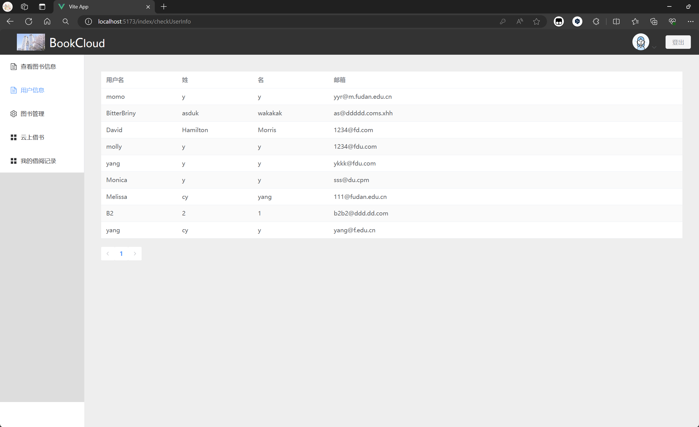
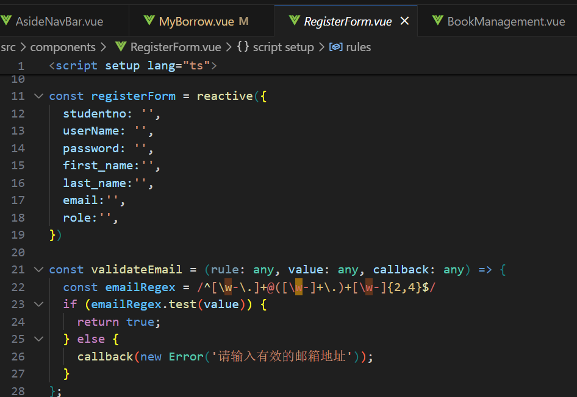

# 图书信息管理系统 报告


## 需求分析

实现一个图书管理系统，对在库图书进行管理，并提供线上借书服务。


## 概要设计

分为管理员端和学生端。

功能：

- 登录、注册：注册需按照要求通过验证，随后根据学号/工号和密码登入系统

- 管理员端可以：

  - 可以查看每本图书的借阅次数、在库情况等信息，也可查看录入新书时设定的全部信息
  - 检索时可以对所有属性模糊搜索，也可按照出版年份或出借次数排序查看（默认表单按照图书编号升序排列）

  - 录入新书的信息，实时在 `书库` 查看
  - `下架` 一本书，即删去一本书的记录
  - 查看所有用户信息、所有用户的借阅情况

- 学生端可以：
  - 查看书库藏书情况，包括基本信息和管理员录入新书时设定的全部信息
  - 借阅图书，`书库` 表单实时更新
  - 查看自己借阅过的图书的全部信息，按借书日期先后排序展示

  


## 详细设计

### 数据库表

关系型数据库存储了三张表，分别为用户信息表 `userlist`，书本信息表 `book`，和借阅关系表 `bs`。

ER图：


```sql
CREATE TABLE userList
(
    id VARCHAR(255) PRIMARY KEY,
    username VARCHAR(255),
    password VARCHAR(255),
    role VARCHAR(50),
    first_name VARCHAR(255),
    last_name VARCHAR(255),
    email VARCHAR(255),
    is_active BOOLEAN,
    studentno VARCHAR(255)
);

CREATE TABLE book
(
    bid VARCHAR(255) PRIMARY KEY,
    title VARCHAR(255),
    author VARCHAR(255),
	category VARCHAR(255),
	status INT, 
    borrowedCnt INT，
    version INT,
    time INT,
    is_active BOOLEAN
);

CREATE TABLE bs
(
    bid VARCHAR(255),
	sid VARCHAR(255),
    dataBorrow VARCHAR(255),
    dateReturn VARCHAR(255),
	expired INT,
	PRIMARY KEY (BID,SID)
);
```

其中，图书信息中，state:0-在库 1-出借。借阅信息中，expired:0-未过期 1-已过期。

**选择使用字符串（string）而不是整数（int）作为 `id`** **，`bid` 字段的数据类型**，因为string更灵活，允许包含更多信息，比整数容量更大，更兼容（当系统需要合并或整合时，使用字符串 ID 可能会更容易处理来自不同系统的数据，因为字符串 ID 降低了合并过程中 ID 冲突的可能性）。但是可能需要考虑 string 与 int 的数据转换，可能会带来不便。

### 字段的作用

1. 图书信息表：`Book`

- **bid** (图书ID): 这是图书的唯一标识符。每本书都有一个不同的编号，用于在数据库中唯一标识这本书。由系统按顺序自动生动。
- **title** (书名): 存储图书的标题。
- **author**: 图书的作者。
- **category**: 图书所属的类别。有助于对图书进行分类管理和搜索。
- **state** (状态): 这个字段标记图书的当前状态，false 表示在库，true 表示已借出。这有助于快速查询可借阅的图书。
- **borrowedCnt** (借阅次数): 记录这本书被借阅的总次数，这有助于分析图书的流行度或者调整图书采购和淘汰策略。
- **version** (出版年份): 记录图书的出版年份，有助于区分同名书籍的不同版本。
- **time**: 图书的入库年份。有助于追踪图书的年龄和更新库存。
- **is_active** (弃用图书与否): 标志位，标记图书是否已被删除。false 表示已被弃用，书库中不会再出现；true 表示仍未下架，会被包括在书库中。

2. 借阅信息表：`BS`

- **bid** (图书编号): 这是图书的唯一标识符，与图书信息表相关联。
- **id** (学生编号): 标识借阅图书的学生，与用户信息表相关联。
- **dataBorrow** (借书日期): 记录学生借书的日期。
- **dateReturn** (还书日期): 若学生未归还图书，记录学生应还书的日期；若书已归还，记录学生实际还书的日期。
- **expired** (是否过期): 标记借阅是否过期，`0` 表示未过期，`1` 表示已过期。这有助于管理罚款和提醒学生及时归还图书。

3. 用户信息表：`User`

- **ID** (用户编号): 唯一标识符。由系统按顺序自动生动。
- **password**（用户登陆时输入的密码）: 加密存储的密码
- **role**: 描述用户的角色或权限级别，用于控制用户在应用程序中的访问权限。
- **is_active**: 表示用户账户是否处于激活状态。常用于控制用户是否可以登录系统，非激活状态的用户可能因为多种原因（如邮箱未验证、账户被暂停等）被禁止登录。
- **studentno**: 学生学号/管理员工号，唯一，用于替代用户名作为登录标识。

### 核心功能的实现方法和流程

#### 书库信息检索

- 书库展示所有`未下架` 的书，分页展示，每页10条记录。sql语句：

```c++
db_res = tx.exec(
	"select b.bid, b.title, b.author, b.category, b.status, b.borrowedCnt, b.version, b.time, b.is_active "
	"from book b "
	"where b.is_active = 'true' "
	"order by b.bid asc "
	"limit 10 offset ?;",
	(page_id - 1) * 10 //参数用于指定 SQL 查询中的偏移量（offset），从而实现分页查询、返回
);
```

- 传参：返回 Book[] 类型，也就是由每条记录（内部是一个个键值对）组成的数据

```c++
boost::json::object list_books(
	std::shared_ptr<bserv::db_connection> conn,
	std::shared_ptr<bserv::session_type> session_ptr,
	const std::string& s_page_id) {
	try{
		//...
		auto books = orm_book.convert_to_vector(db_res);
		boost::json::array json_books;
		for (auto& book : books) {
			json_books.push_back(book);
		}
		return { {"books", json_books}, {"total_books", total_books}, {"total_pages", total_pages} };
	}
	catch (const std::exception& e) {
		lgerror << "Failed to list books: " << e.what() << std::endl;
		return { {"success", false}, {"message", "Failed to fetch books due to an internal error."} };
	}
}
```

- 界面展示：


​	点击“详情”查看详细信息。搜索框可模糊搜索。


#### 图书录入

- 使用 `INSERT` 语句将新书的信息添加到 `Book` 表。
  
  ```c++
  bserv::db_result r = tx.exec(
  	"INSERT INTO book"
  	"(bid, title, author, category, status, borrowedCnt, version, time, is_active) VALUES"
  	"(?, ?, ?, ?, ?, ?, ?, ?, ?);",
  	next_bid, params["title"], params["author"], params["category"], 0, 0, params["version"], params["time"], true
  );
  ```
  
- **bid是自动分配的**，逻辑是：找到当前book数据表中最大的bid，随后+1

  实现：

```c++
// 获取最新的 BID
// 首先检査结果集是否为空，然后检査返回的最大 BID 是否为非空值。如果都满足，我们将其作为整数读取出来，并计算下一个 BID
// 当表中没有记录时，MAX(bid)会返回一一个空值。这也是为什么我们需要检査返回的值是否为 NULL。
bserv::db_result res = tx.exec("SELECT MAX(bid) FROM book;");
int next_bid = 000000;
if (res.begin() != res.end()) { 
    if (!(*res.begin())[0].is_null()) { //判空。注意空值应写：(*res.begin())[0].is_null()
        int current_max_bid = (*res.begin())[0].as<int>(); 
        next_bid = current_max_bid + 1;
    }
}
```

- **category是可选的**，选择范围是当前book表中所有不同的类型，若无可输入。实时更新，故需要确保这些数据从后端动态获取。

```c++
//获取所有唯一的书籍分类
boost::json::object get_book_categories(
	std::shared_ptr<bserv::db_connection> conn
	) {
	try {
		bserv::db_transaction tx{ conn }; // 使用传入的数据库连接开始一个事务
		bserv::db_result find_cat = tx.exec("SELECT DISTINCT category FROM book;");
		
		auto categories = orm_single_string.convert_to_vector(find_cat);
		boost::json::array json_categories;
		for (auto& category : categories) {
			json_categories.push_back(category);
		}
//		tx.commit();
		return { {"category_list", json_categories} };	//引号里的是键值对的名字！！！！要对应api里的interface！！
	}
	catch (const std::exception& e) {
		// 如果发生错误，打印错误信息并返回错误信息
		std::cerr << "Failed to fetch book categories: " << e.what() << std::endl;
		return { {"success", false}, {"message", e.what()}};
		// 返回一个成功信息 + 一个category的列表
	}
};
```

- 界面展示：

  入口：

  表单：录入前需通过参数验证。入库年份自动填写为当前年份，也可以修改。

  

  （新建一本：）

  

  （实时更新：）

  


#### 下架图书信息（删除）

使用 `UPDATE` 语句将 `is_active` 改为 `false`。

```c++
std::optional<boost::json::object> delete_books(
	std::shared_ptr<bserv::db_connection> conn,
	std::shared_ptr<bserv::session_type> session_ptr,
	const std::string& bookid) { //是string，因为数据库book中bid数据类型是string
	lgdebug << "view bid: " << bookid << std::endl;
	bserv::db_transaction tx{ conn };

	bserv::db_result r = tx.exec(
	"select * from book where bid = ?", bookid);
	lginfo << r.query(); // this is how you log info
	if (r.begin() != r.end()) {
		bserv::db_result afterdelete = tx.exec(
			"update book "
			"set is_active = 'false' "
			"where bid = ?;",
			bookid);
		tx.commit();
		return orm_book.convert_to_optional(afterdelete);
	}
}
```

界面展示：“查看用户信息”-“书库”-“操作”-“下架”，即可删除这本书的记录。


（点击“下架”后：）


#### 借书

- 借书流程：

  - 检查 `Book` 表中图书的状态，确保其为“在库”。

  - 在 `BS` 表中添加一条新的记录，记录借阅的详细信息。

  - 更新 `Book` 表中的状态为“已借出”。并更新 `borrowedCnt` 为 `borrowedCnt + 1`

    `UPDATE Book SET state = 1, borrowedCnt = borrowedCnt + 1 WHERE BID = 某ID;`
    
    ```c++
    boost::json::object BorrowBook(
    	std::shared_ptr<bserv::db_connection> conn,
    	std::shared_ptr<bserv::session_type> session_ptr,
    	boost::json::object&& params // 一个JSON对象，包含请求的所有参数
    ) {
    	try {
    		bserv::db_transaction tx{ conn };
    		// 安全地从 JSON 对象中提取字符串，确认所有必需字段都存在且为字符串
    		lginfo << params;
    		lginfo << params["bid"];
    		bserv::db_result db_res = tx.exec(
    			"INSERT INTO bs (bid, id, databorrow, datereturn, expired) "
    			"VALUES (?, ?, ?, ?, ?);",
    			params["bid"], params["id"], params["databorrow"], params["datareturn"], false);
    		lginfo << db_res.query();
    
    		db_res = tx.exec(
    			"UPDATE book "
    			"SET status = 1 "
    			"WHERE bid = ?",
    			params["bid"]
    		);
    		lginfo << db_res.query();
    
    		db_res = tx.exec(
    			"UPDATE book "
    			"SET borrowedCnt = borrowedCnt + 1 "
    			"WHERE bid = ?",
    			params["bid"]
    		);
    		lginfo << db_res.query();
    
    		tx.commit();
    
    		return {
    			{"success", true},
    			{"message", "Book borrowed successfully"}
    		};
    	}
    	catch (const std::exception& e) {
    		lginfo << e.what();
    		return {
    			{"success", false},
    			{"message", "Failed to borrow book: " + std::string(e.what())}
    		};
    	}
    }
    
    //WebApp.cpp
    		bserv::make_path("/borrowbook", &BorrowBook,
    			bserv::placeholders::db_connection_ptr,
    			bserv::placeholders::session,
    			bserv::placeholders::json_params),
    ```
    
    

  界面展示：点击 `借阅`，能立刻看到图书状态和出借次数都更新了。

  （借书前的借阅记录：）

  

  （借书前的书库信息：）

  

  （借书后：）有消息提示成功借书

  

  ​					我的借阅记录也同步更新：

  

  

  **特殊条件测试**

  当然，没有库存的不能借：

  

  

- 还书也可类似地实现：

  - 更新 `BS` 表中的 `dateReturn` 字段。
  - 检查是否超期，并据此更新 `expired` 字段。
  - 将 `Book` 表中的状态更新为“在库”。


#### 学生借阅查询

- 查询个人历史借阅：使用 `SELECT` 语句结合 `SID` 查询 `BS` 表中的借阅记录。
- 返还个人借阅总次数：在前端中用一个响应式变量计算表单行数。

```c++
boost::json::object MyBorrow(
	std::shared_ptr<bserv::db_connection> conn,
	std::shared_ptr<bserv::session_type> session_ptr,
	boost::json::object&& params // 一个JSON对象，包含请求的所有参数
) {
	bserv::db_transaction tx{ conn };
	lginfo << params["id"];
	bserv::db_result db_res = tx.exec(
		"SELECT c.id, c.databorrow, c.datereturn, c.expired, b.title, b.author, b.bid, b.category, b.version "
		"FROM book AS b, bs AS c "
		"WHERE c.id = ? AND c.bid = b.bid "
		"ORDER BY c.databorrow DESC;",
		params["id"]);
	lginfo << db_res.query();

	tx.commit();

	auto bsrs = orm_bsrelation.convert_to_vector(db_res);
	boost::json::array json_bsr;
	for (auto& bsr : bsrs) {
		json_bsr.push_back(bsr);
	}
	lginfo << json_bsr;

	return {
		{"MyBorrowRespList",json_bsr},
		{"success", true},
		{"message", "Query successfully"}
	};
}

//WebApp.cpp
		bserv::make_path("/query/myborrow", &MyBorrow,
			bserv::placeholders::db_connection_ptr,
			bserv::placeholders::session,
			bserv::placeholders::json_params),
```

界面展示：


#### 用户信息查询

`list_users` 函数，逻辑和 `list_books` 相似。界面展示：




补丁：

我的用户表中有一个区分用户角色的字段 `role`，这样就可以在用户登录时检查他们的角色，并根据角色提供不同的数据和服务。但是没有做两个入口（系统有待以后升级）。


## 部署方法

首先默认是登陆界面，新用户需要先注册。注意需要是标准邮箱格式：


（是由正则表达式匹配的：）



随后可登录到主界面。左边是侧边导航栏，依次实现了查看书库、用户信息、图书管理（录入新书）、云上借书、查看个人借阅记录五个功能。“详情”按钮可以点开图书的全部信息，搜索栏旁边的reset是清空输入栏以便于重新搜索，其他按钮都有明显提示。

总之界面非常用户友好，有丰富的消息提示操作成功或失败及其原因，新用户也可轻松使用。