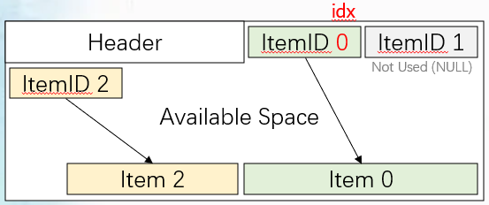
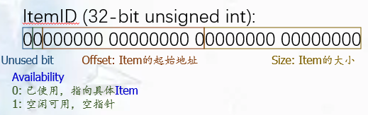
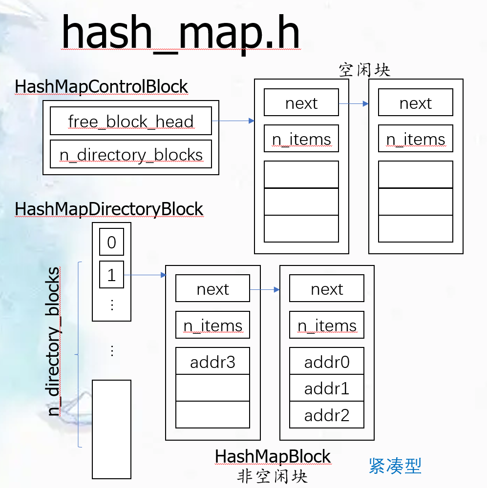
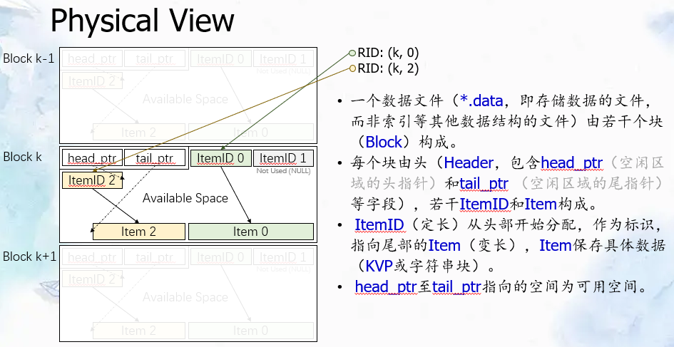
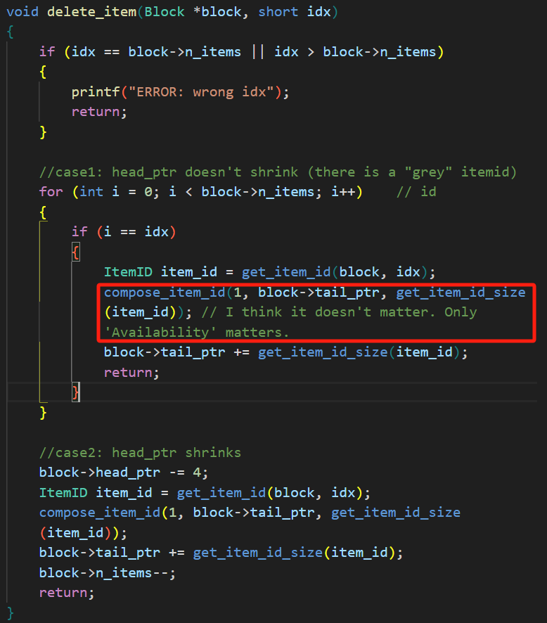

# 智雄哥的提醒


1. hash_map

 a. 计算字典块编号时使用size / HASH_MAP_DIR_BLOCK_SIZE + 1；计算块内位置时用 size % HASH_MAP_DIR_BLOCK_SIZE

 b. pop_lower_bound如果找不到，应该默认输出-1

2. 内存操作：**使用block + offset/tail_ptr指向地址时，一定要用(char*)block强制转换**

3. 测试

 a. hash_map的测试需要几分钟

 b. test_hash_map似乎不会测试block中的内容

 c. 将测试中的out参数调为1，能向外**打印**一些关于测试的信息

 d. void my_exit(const char* error) {

   printf("%s\n", error);

   // system("pause");

   exit(1);

  } 可以在file_io.c和file_io.h中加入这个调试函数和它的声明，在发生异常时直接退出。结合ctest -C Debug --rerun-failed --output-on-failure可以在控制台打印相关信息，e.g. my_exit("buffer_pool.c, get_page Error, fail to read");

用my_exit异常退出后，如果有对文件可持续化的判断，要手动在build/test文件夹下删除创建的test文件

e. 如果test_hash_map调试较慢，可以在test_hash_map.c中选择最小参数的那一组


 

# 文件

## file_io

- 作用：对磁盘文件的开关读写

- 函数

1. open_file, 打开文件，并自动读取file->length
2. close_file, 关闭文件，并清空*file中内容
3. read_page, 读文件，确保addr < file->length
4. write_page, 写文件，**如果addr = file->length，则会自动为file->length加上PAGE_SIZE，相当于获取了新的一页**

- 存储结构

1. FileInfo，一个FILE*为文件指针(用于系统函数)，length表示文件长度，存在内存中
2. Page，一个长为PAGE_SIZE的字符串，会具体存到磁盘中

- 关系

1. 向下对应磁盘操作
2. 向上为buffer_pool提供接口，除buffer_pool外不应有其他模块直接访问

```c
FileIOResult open_file(FileInfo *file, const char *filename) {
    if (file->fp = fopen(filename, "rb+")) {
        /* the file exists and is successfully opened */
    } else if (file->fp = fopen(filename, "wb+")) {
        /* the file does not exist and is successfully created */
    } else {
        return FILE_IO_FAILED;
    }
    if (fseek(file->fp, 0, SEEK_END)) { //将文件指针移动到文件的末尾，用于计算文件的总长度
        return FILE_IO_FAILED;
    }
    file->length = ftell(file->fp);  //ftell函数返回当前文件指针的位置，即文件的长度
    if (file->length & PAGE_MASK) {   //使用位运算符&来检查file->length是否为页面大小（PAGE_MASK定义了页面大小的位掩码）的整数倍。如果结果非0，说明文件长度不是页面大小的整数倍，关闭文件，返回INVALID_LEN表示长度无效。
        close_file(file);
        return INVALID_LEN;
    }
    return FILE_IO_SUCCESS;
}
```


## buffer_pool

- 作用：管理缓冲区，**缓冲 8 个pages**。并为磁盘操作提供上层抽象接口

  

- 函数

1. init_buffer_pool, 初始化缓冲池，打开文件，并为BufferPool结构中的成员初始化(不要对pool分配内存！)

   FileIOResult res = open_file(&f, **filename**);  //不是”filename“

2. close_buffer_pool, 关闭缓冲池

3. **get_page**, 读取出缓冲池中指定地址addr对应的页。

   当程序需要访问特定地址 addr 上的数据时，这个函数负责从缓冲池中找到对应的页，如果该页已在缓冲池中，直接返回该页的指针。找不到则从磁盘中读取 addr 指定的数据到LRU策略选择的“空闲”页（现在未被引用的页）中。**替换时会写回”脏页“**（其他时候被修改的页是保存在buffer pool中的，只有它要被buffer pool踢走的时候才同步到内存(disk)中）

   设计为返回一个指向 `Page` 结构的指针，这个结构通常代表了磁盘或内存中的一个固定大小的数据块（如一个页面的数据）。这个函数在设计上是通用的。所以**后续使用要强制类型转换：**

   HashMapControlBlock* ctrl = **(HashMapControlBlock*)**get_page(pool, 0);

4. **release：对这页使用完毕后，解锁它。**

   ```c
   // 扫描 for
   // 先看有没有空的地方：addrs[i]=-1表示没人用，那就是空的
   // 有空的就从硬盘读入：addrs[i]=addr, cnt[i]++, ref[i]++，然后返回这页的地址
   // 没有空的：找一个cnt最小的，表示最近访问次数最少的，返回回去
   // 异常：没有空余的缓冲区了，可以做一下缺页处理
   Page *get_page(BufferPool *pool, off_t addr)
   {
       for (int i = 0; i < CACHE_PAGE; i++)
       {
           if (pool->addrs[i] == addr)
           {
               pool->cnt[i]++;
               pool->ref[i]++;         // ref=1: using now
               return &pool->pages[i]; // read out the page
           }
       }
   
       int free_pages[CACHE_PAGE] = {0}; // ids of free pages
       int free_i = 0;
       for (int i = 0; i < CACHE_PAGE; i++) // find all free pages
       {
           if (pool->ref[i] == 0)
           {
               free_pages[free_i] = i;
               free_i++;
           }
       }
       int getid = -1;
       int min_cnt;
       for (int k = 0; k < free_i; k++)
       {
           if (k == 0)
           {
               min_cnt = pool->cnt[free_pages[0]];
           }
           else
           {
               if (min_cnt > pool->cnt[free_pages[k]])
               {
                   min_cnt = pool->cnt[free_pages[k]];
                   getid = free_pages[k];
               }
           }
       }
   
       if (getid == -1)
       {
           printf("ERROR: no free page");
       }
       else
       {
           pool->addrs[getid] = addr;
           FileIOResult iores = write_page(&pool->pages[getid], &pool->file, pool->addrs[getid]); // 将要替换的页写回（可能改了数据所以要先写回）
           printf("write back: ", iores);
           printf('\n');
   
           iores = read_page(&pool->pages[getid], &pool->file, addr); // addr位置的页读入缓冲池
           printf("read page into buffer pool: ", iores);
           printf('\n');
           if (iores == ADDR_OUT_OF_RANGE && addr >= 0)
           {
               // 也就是没有成功读入
               // 缺页处理：原file加一页，buffer pool读入一个empty page
               pool->file.length = addr + PAGE_SIZE;
               memset(&pool->pages[getid], 0, PAGE_SIZE); // 清空页面内容
               pool->addrs[getid] = addr;
               pool->cnt[getid]++;
               pool->ref[getid] = 1;
           }
           else if (iores == FILE_IO_SUCCESS)
           {
               pool->addrs[getid] = addr;
               pool->cnt[getid]++;
               pool->ref[getid] = 1;
           }
       }
       return &pool->pages[getid];
   }
   ```

- 数据结构

1. BufferPool 在内存中维护
2. FileInfo 文件信息，用于file_io
3. page 页的具体内容
4. **addr 上述页对应的物理地址**
5. **cnt** 对应页被访问的记录，用于实现 **LRU（Least Recently Used）**策略：
   - 用一个数组来存储数据，给每一个数据项标记一个访问时间戳，每次插入新数据项的时候，**先把数组中存在的【所有其他】数据项的时间戳自增，并将新数据项的时间戳置为0并插入到数组中。**每次访问数组中的数据项的时候，将被访问的数据项的时间戳置为0。当数组空间已满时，将时间戳最大的数据项淘汰。
   - 可考虑自制一个时间戳，加上一个计数的cnt一起用
   - 应为 off_t 类型：因为初始化为-1，用size_t类型不改的话会将-1变成别的值
6. ref 对应页正在被多少个事务占用，从而决定其是否能被释放

- 关系

1. 向下对file_io进行封装
2. 向上为table和hash_map提供接口

 

## block

- 缓冲池是一种缓存机制，用于在内存中保留最近或频繁使用的数据页面，以减少磁盘I/O操作。

- 提供功能：缓存页面。页面替换(LRU)，延迟写回

- 数据结构：

  **block = page**（大小一致。block是实际使用的。page是在buffer pool中的，为了缓冲）
  
  - 认为**n_items**是block中**分配过的 ItemID 的个数**，从1开始。**和这个 ItemID 有没有对应后面某个实体的 Item 无关。**

  - **ItemID**从0开始。所以n_items=下一个填入的item_id（前面前部填满时）

  - 大菠萝是因为先递增n_items了所以最后返回值要 -1
  
  - **idx** 是ItemID块的位序，从0开始顺次排序到n_items-1。不会跳。
  
    
  
    
  
    ```c
    typedef struct
    {
        /* header section */
        short n_items;                       /* number of allocated ItemPtr's */
        short head_ptr;                      /* free space begin */
        short tail_ptr; /* free space end */ 
        // a number, use like this: (char*)block + block->tail_ptr
        char data[PAGE_SIZE - 3 * sizeof(short)]; /* placeholder only */
    } Block;
    
    
    typedef unsigned int ItemID;
    typedef char *ItemPtr;
    
    #define get_item_id_availability(item_id) (((item_id) >> 30) & 1)
    #define get_item_id_offset(item_id) (((item_id) >> 15) & ((1 << 15) - 1))
    // offset: where the item is literally stored in the block (usually starts from the back)
    #define get_item_id_size(item_id) ((item_id) & ((1 << 15) - 1))
    
    #define compose_item_id(availability, offset, size) ((((availability) & 1) << 30) | (((offset) & ((1 << 15) - 1)) << 15) | ((size) & ((1 << 15) - 1)))
    
    #define get_item_id(block, idx) (*(ItemID *)((block)->data + sizeof(ItemID) * (idx)))
    // 取 id 块 Item 对应的 item_id
    ```
  
    

- 作用：具体对每一块(一块即一页)中具体的数据条目进行增删查

- 函数

1. init_block, 对Block结构进行初始化

2. get_item, 给定对应item的编号，获取指向该数据的指针(char*)

3. **new_item**, 插入一个新的元组：

   向block插入大小为item_size，起始地址为item的Item，返回插入后的项号（idx）。插完要修改Block中的对应值

   后续调用时，**返回的是一个short（相对值），要 (char*)block + 【返回值】;**

   ```c
   short new_item(Block *block, ItemPtr item, short item_size)
   {
       // don't forget the case: not enough space
       if (block->tail_ptr - block->head_ptr < item_size)
       {
           printf("ERROR: not enough space");
           return -1;
       }
       // 向block插入大小为item_size，起始地址为item的Item，返回插入后的项号（idx）
       for (int i = 0; i < block->n_items; i++)    // id
       {                                           // 看看有没有没填上的itemid
           ItemID item_id = get_item_id(block, i); // id -> item_id
           if (get_item_id_availability(item_id) == 1)
           {
               block->tail_ptr = block->tail_ptr - item_size;
               item_id = compose_item_id(0, block->tail_ptr, item_size); // ItemID should be composed to update(because it's new)
               char *now_ptr = (char *)block + block->tail_ptr;
               memcpy(now_ptr, item, item_size); // copy the content into the item
               return i;
           }
       }
       block->head_ptr = block->head_ptr + 4;
       block->tail_ptr = block->tail_ptr - item_size;
       get_item_id(block, block->n_items) = compose_item_id(0, block->tail_ptr, item_size); // ItemID should be composed (the same)
       char *now_ptr = (char *)block + block->tail_ptr;
       memcpy(now_ptr, item, item_size); // copy the content into the item
       block->n_items++;                 // one more allocated item, so cnt++
       return block->n_items;
   }
   ```

   

4. delete_item, 删除一个元组，并整理存储空间(注意ItemID的空间不能重排)(也可考虑别的整理策略)，删完要对Block中的对应值进行修改

5. 注：unavailable对应的的是空间不可用，即数据有效的


- 存储结构

1. Block, 块中具体内容，存储在磁盘中，要保证总大小为一页

2. n_item, 有几个分配了的Item(包括被删除后无效的)

3. head_ptr, 指向最后一个ItemID的末尾。是short类型。

   使用方法：**char *now_ptr = (char *)block + block->tail_ptr;**

4. tail_ptr, 指向第一个Item的开头(对应的编号不一定是最大的)

- 关系

1. 没有更下一层，只会调用自己的函数
2. 向上为table提供对具体数据条目读写的支持


## hash_map

- 哈希表建立在缓冲池之上：

  哈希表的每个部分（如控制块、目录块、数据块）都映射到缓冲池中的页面。

  每次需要访问或修改哈希表的某部分时，通过缓冲池获取相应的页面。

- 数据结构：

  是一个buffer pool。**都是offset：**

  ```c
  typedef struct
  {
      off_t free_block_head;	// -1 when empty
      off_t n_directory_blocks;
      off_t last_page; //作用：当控制块中的 free_block_head 没有有空闲块可用时，使用 lastpage 指向的地址作为新数据块的位置
      //off_t max_size; // maxsize of the free space. (Hash table manages free space.) max_size <= page_size
  } HashMapControlBlock;
  
  #define HASH_MAP_DIR_BLOCK_SIZE (PAGE_SIZE / sizeof(off_t))
  
  typedef struct
  {
      off_t directory[HASH_MAP_DIR_BLOCK_SIZE];
  } HashMapDirectoryBlock; //0开始，每个dirblock有两个offset
  
  #define HASH_MAP_BLOCK_SIZE ((PAGE_SIZE - 2 * sizeof(off_t)) / sizeof(off_t))
  
  typedef struct
  {
      off_t next;	// -1 when empty
      off_t n_items;
      off_t table[HASH_MAP_BLOCK_SIZE];
  } HashMapBlock;
  ```

  

  

  一页PAGE_SIZE = 128，off_t 是 int64 类型。所以1个page存两个offset

  **非空闲块**用于存储哈希表中的实际数据。当一个块被填满时，如果需要存储更多的数据，会分配新的块并将其链入现有块的链表中。

  **空闲块**是那些目前不包含有效数据的块。它们被标记为可重用，当需要新的块来存储数据时，这些空闲块会被重新分配。

  • *.fsm文件由若干块构成。

  •**第 0 块**(block 0)**是控制块（HashMapControlBlock）**。

  • free_block_head块保存空闲块链表头指针。

  •**第 1 ~ n_directory_blocks 块是哈希表目录块HashMapDirectoryBlock，按空闲空间大小对应（所以后续函数的形参是size）**（比如#1-0：空闲大小为2），构成哈希表目录，按空闲空间大小分类保存（*.data文件中）块的地址。

  •其余均为哈希表块（HashMapBlock），以链表形式组织，保存哈希表块链表头指针。

- 作用：为数据插入，快速查找空地址(其实是空间大小与哈希值是一一对应)

- 函数

  哈希表用来管理空闲空间

1. hash_table_init, 初始化哈希头与哈希字典，先要**初始化支持哈希块的buffer_pool，之后利用 get_page+'类型转换' 对哈希头与哈希字典进行初始化**

2. hash_table_close, 关闭缓冲池即可

3. hash_table_insert, 插入一个值(对应的是addr对应页有size的可用空间)，保证size不大于PAGE_SIZE(一个页中的可用空间肯定不会大于页的大小)，先找到对应的哈希字典块的对应位置，找到第一有空位的块，放入地址(数据地址无效时应该设为-1，因为对应的是存储数据的地址，数据没有头；哈希无效地址可以设为0，因为哈希有头，0x0不可能放HashMapBlock)。如果找不到空闲地址，则先看哈希头对应的free_block_head，如果也没有则用get_page新增一页

4. **hash_table_pop_lower_bound，查找并删除一个大小不小于指定值的块，**更适合在需要动态分配内存块的场景下使用。获取含有比size大的数据空间的地址，如果没有则返回-1，且获取之后要删除对应数据，并更新整个哈希结构(尤其是把一个block删完了的情况)

5. hash_table_pop, 删除指定地址在哈希结构中的空间

   trick: 填上addr的空缺：用table的最后一项填过来（因为全部前挪一个太浪费时间）

6. **每次get_page之后一定要release**，如果有dirty设计，则在更新之后一定要set_dirty

- 存储结构 (都在磁盘中，要注意大小不超过PAGE_SIZE)

1. HashMapControlBlock, 哈希头，维护哈希表的基本信息，存在磁盘中，但实际占不满一页
2. HashMapDirectoryBlock, 哈希字典块，每个槽位唯一对应一个size值，并指向一个哈希块，存储在磁盘中
3. HashMapBlock, 哈希块，每一块中存储有一定相同size大小对应的页地址，存储在磁盘中

- 关系

1. 向下由buffer_pool提供获取块(在buffer_pool中为页)的接口
2. 向上为table的增删提供数据地址的快速查找


```c

```


## table

- 作用：基于表级的，对数据条目的增删查的更高抽象的操作

- 函数

1. table_init, 对表对应的数据缓冲池和哈希结构进行初始化
2. table_close, 关闭数据缓冲池和哈希结构
3. table_get_total_blocks, 返回数据块的个数
4. table_block_get_total_items, 返回表中所有分配的条目数
5. table_read, 在指定RID读取出对应的数据，并赋给dest(保证有足够的空间)
6. table_insert, 向表中插入src所指位置，size大小的数据条目。先用lower_bound获取能存下的地址(**要在size上加sizeof(ItemID)，不然可能放不下**)(如果没有则自己新创一个Block，新建之后一定要init)，再使用block中的接口放入数据，并将剩下的size放回到哈希(可考虑采用-4“谎报”，因为除了数据条目，有可能ItemID也需要4字节的空间)，并制作返回该条目对应的RID
7. table_delete, 删除指定条目，先在哈希结构中删除对应block的size，然后在数据块中删除该条目，再将剩下的size插回到哈希结构
8. //注：对于Block的get_page之后一定要release，如果有dirty设计，则在更新之后一定要set_dirty

- 数据大小

1. addr - off_t
2. idx - short

- 存储结构 (都在内存中)

1. Table 表，对应有数据块的缓冲池和哈希结构块的缓冲池
2. RID 数据条目编号，存有对应数据块地址和块内编号

- 关系

1. 向下有block支持块内的数据操作，hash_map支持对空闲空间的查找
2. 向上为str中的字符串数据存储删除提供接口

 

## str

- 作用：为字符串的读写，比较提供接口

- 函数 (手动写chunk.data时要注意偏移)

1. read_string, 从给定的rid读出对应字符串的第一个chunk，并组织成StringRecord的形式(由于一个数据条目最长只有STR_CHUNK_MAX_SIZE，所以直接给传入table_read的dest分配这么多内存即可，之后要记得释放)(在组织数据的时候，要先从dest中得到size，再用calc_str_chunk_size将指定大小的数据放到结构体中)
2. has_next_char, 判断是否还有下一个字符，先看record->idx有没有达到record->chunk.data的size处，没有再看这个chunk是不是最后一个(通过看chunk.data中下一个rid是否有效)
3. next_char, 返回当前record->idx所指的char，并将idx移动到下一位置
4. compare_string_record, 字符串比较，利用has_next_char和next_char
5. write_string, 写字符串，递归操作，如果size大于STR_CHUNK_MAX_LEN(注意不是STR_CHUNK_MAX_SIZE，因为这里算的只是字符数据的长度，没有加上next_rid和size)则触发递归，要注意table_insert中的size是加上了next_rid和size的长度的
6. delete_string, 删除指定rid为头的字符串数据，在删之前读出该数据条目，并判断next_rid是否有效，若是则继续删除
7. load_string, 从以record开头的chunk中读出最长为max_size的字符串，并在末尾加上'\0'(似乎包含在max_size中)，返回实际读出的大小

- 存储结构

1. StringChunk, 存储到磁盘中，由下一页的rid，当前块的size，以及实际的字符串数据(不一定占满)
2. StringRecord, 在内存中管理，起到对StringChunk的包装，并利用idx(在当前chunk中遍历到了哪个位置)实现遍历操作

- 关系

1. 向下由table直接提供读写查的接口
2. 向上向myjql提供读写字符串的支持


# MYJQL记录

void ***memset**(void *str, int c, size_t n)

复制字符 c（一个无符号字符）到参数 str 所指向的字符串的前 n 个字符。

void \*memcpy(void*dest, const void *src, size_t n);

由src指向地址为起始地址的连续n个字节的数据复制到以destin指向地址为起始地址的空间内。


在 MySQL 启动的时候，**InnoDB 会为 Buffer Pool 申请一片连续的内存空间，然后按照默认的16KB的大小划分出一个个的页， Buffer Pool 中的页就叫做缓存页**。此时这些缓存页都是空闲的，之后随着程序的运行，才会有磁盘上的页被缓存到 Buffer Pool 中。

## 数据结构

- `Page` 结构体包含了一个名为 `data` 的字符数组，大小定义为 `PAGE_SIZE`。这个结构体设计用于表示文件系统或数据库系统中的一个"页"。
  - 操作系统通常以页为单位管理内存。将数据封装为固定大小的页可以方便地映射到物理内存或虚拟内存页，从而优化内存的使用和访问速度。

## 为什么空闲空间都放在中间



好处：方便管理，插入数据只需要看中间够不够

坏处：每次删除需要把被删除块前面的所有item后移，这样才保证所有的item在一起、都在最后


# Q

意思是file里面还没有8页的时候，缓冲池写回到file回遇到这种情况嘛


# LOG


